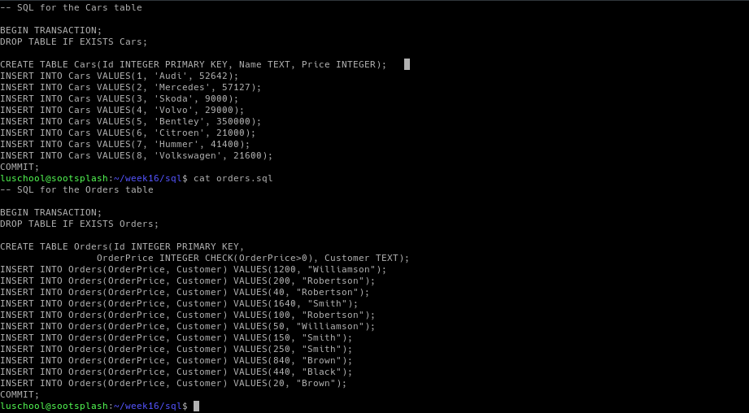
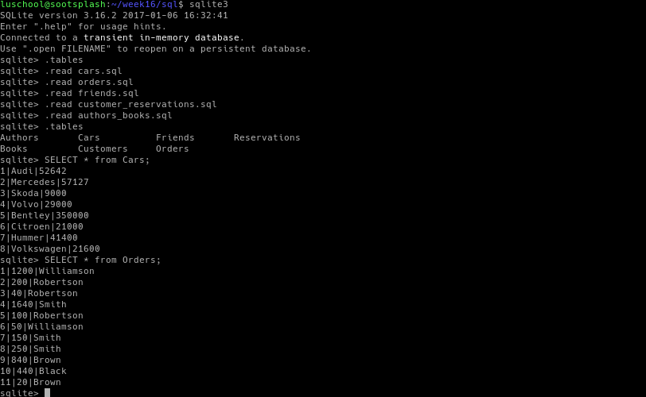

# Week16

This week we went over sql and using python. 

## Python Summary -  

Using `#!/usr/bin/env python` we can run python scripts in the shell.

In my Monday class Introduction to Computing and Programming Concepts
we have been learning python so rather than do the basic Hello World
I decided to copy over my script I made for a programming assignment
a few weeks ago and see if it works.

```
#!/usr/bin/env python
# Programming assignment from my other class

def poundstokilograms(pounds):
    kilograms = pounds * 0.45359237
    return float(kilograms)

def inchestometers(inches):
    meters = inches * 0.0254
    return float(meters)

def bmicalc(m, kg):
    bmi = kg / ( m * m )
    return float(bmi)

def bmiresult(bmi):
    if bmi <= 18.5:
        return str('Underweight')
    elif bmi > 18.5 and bmi < 25:
        return str('Normal')
    elif bmi > 25 and bmi < 30:
        return str('Overweight')
    elif bmi > 30:
        return str('Obese')
e I
while True:
    try:
        pounds = float(input ("Please input your weight in Pounds with numbers only: "))
        inches = float(input ("Please input your height in Inches with numbers only: "))
    except ValueError:
        print("Please only input numbers")
    else:
        break

m = inchestometers(inches)
kg = poundstokilograms(pounds)
bmi = bmicalc(m, kg)
result = bmiresult(bmi)

print("That is equal to %.2f Kilograms and %.2f Meters" % (kg, m))
print("Giving a Body Mass Index(BMI) of %.2f which is considered %s." % (bmi, result))
print("\n")
```

I ran the command ./pythontest.py in my terminal and it works exactly
as expected.


## SQL Documentation -  

Using Week 16s module I followed along the commands for the lab while
connected to sootsplash via ssh.

Here are some screenshots -





